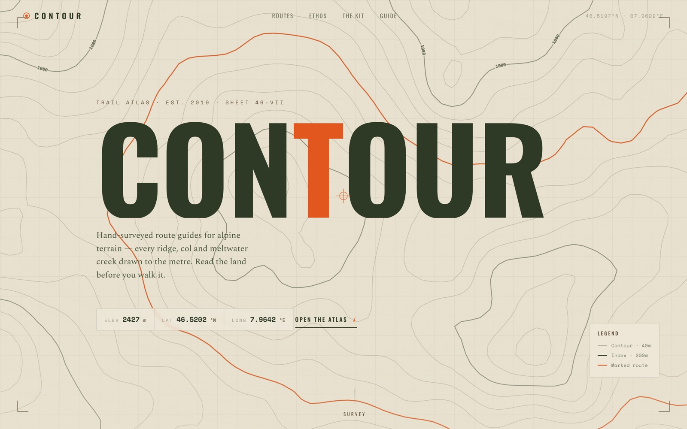

<!-- parable:beautified -->
<div align="center">

<h1>Contour</h1>

<p><strong>Outdoor / trail atlas with animated topographic contours.</strong></p>

<p>
  <a href="https://bswxyz.github.io/formwork-contour/"></a>
  
  
  <a href="LICENSE"></a>
</p>

<p>
  <a href="https://bswxyz.github.io/formwork-contour/"><b>Live demo</b></a>
  &nbsp;·&nbsp;
  <a href="https://bswxyz.github.io/formwork-contour/guide/">Build notes</a>
  &nbsp;·&nbsp;
  <a href="https://parable-three.vercel.app/templates">More templates</a>
</p>

<a href="https://bswxyz.github.io/formwork-contour/">
  
</a>

</div>

**Use this template** — copy the source into a new project:

```bash
npx degit bswxyz/formwork-contour my-app
```


**Live demo → https://bswxyz.github.io/formwork-contour/** · [How it was built](https://bswxyz.github.io/formwork-contour/guide/)

> A trail-atlas brand on warm paper, with animated topographic contour lines drawn live on canvas.

A free, MIT-licensed website template. Good for: **outdoor brands, hiking apps, national parks, travel journals**.
The demo brand ("CONTOUR") is fictional — every word and colour is meant to be replaced with yours.

## The signature technique

- Marching-squares iso-contours of an animated noise field — a breathing topo map
- Elevation labels ride the rings; live ELEV/LAT/LONG readout
- Routes table with inline SVG elevation-profile sparklines

## Use this as your own site

This repo is a **template** — everything is plain HTML/CSS/JS with **relative paths**, so it
works under *any* repo name with zero configuration.

1. Click **Use this template → Create a new repository** (top of this page).
   **Name it whatever you like** — `my-site`, `portfolio`, anything.
2. In your new repo: **Settings → Pages → Build and deployment → Deploy from a branch**,
   then pick `main` / `/ (root)` and save. (CLI: see below.)
3. Wait ~1 minute. Your site is live at `https://YOUR-USERNAME.github.io/YOUR-REPO-NAME/`.

<details>
<summary>Prefer the command line?</summary>

```bash
gh repo create my-site --template bswxyz/formwork-contour --public --clone
cd my-site
gh api --method POST /repos/YOUR-USERNAME/my-site/pages \
  -f 'source[branch]=main' -f 'source[path]=/'
```
</details>

No build step, no dependencies to install — edit the files, push, done.
The only external requests are Google Fonts and (where used) pinned CDN copies of GSAP/three.js.

## Customize it

- Terrain: noise scale/speed and contour interval constants in `main.js`
- Routes: add rows with distance/gain/difficulty — sparkline reads its own points attribute
- Palette: sand/moss/signal-orange in `:root`

The `/guide/` page documents the signature technique in depth (with code) — keep it, rewrite it,
or delete the folder entirely.

## Files

```
index.html        the page
styles.css        all styling (design tokens in :root at the top)
main.js           the signature effect + motion
guide/index.html  how-it-works write-up (optional — yours to keep or delete)
```

## Built-in quality

- Works with JS disabled or a CDN failure (content is never permanently hidden)
- Respects `prefers-reduced-motion`; keyboard focus styles throughout
- Canvas/WebGL feature-detected with graceful fallbacks; devicePixelRatio capped for performance
- Responsive at phone / tablet / desktop widths

## License & credit

[MIT](LICENSE) — free for personal and commercial use, no attribution required
(a link back is always appreciated). Part of **FORMWORK** — a collection of
25 free website templates: **[the full gallery →](https://bswxyz.github.io/formwork/)**
